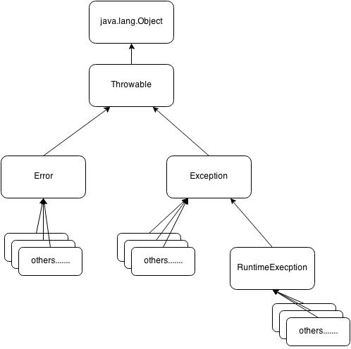
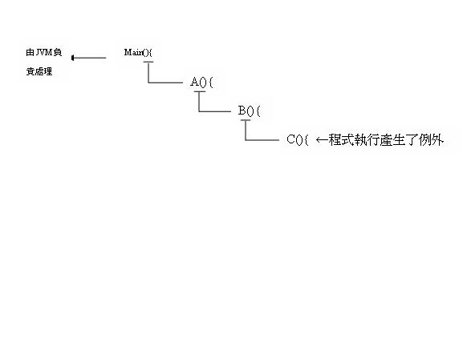

CH.12  Error handling with Exceptions
======


## Outline

- [前言](#前言)
    + [Error & Exception](#Error & Exception)
	+ [Exception-handling的重要](#Exception-handling的重要)
- [Throwable](#Throwable)
	+ [Error](#Error)
	+ [RuntimeException](#RuntimeException)
	+ [Exception](#Exception)
- [Throw](#Throw)
- [Tryblock](#Tryblock)
- [建造自己的 exceptions](#建造自己的 exceptions)
- [Catch all the exceptions](#Catch all the exceptions)
- [重擲異常](#重擲異常)
- [Checked Exception的爭議](#Checked Exception的爭議)

-
## 前言

### Error & Exception
程式於執行過程中，發生了預料之外的情況而造成程式無法繼續執行下去，Java將這種錯誤大致上分為兩類
- error:無法由程式自行進行處理的重大的錯誤如作業系統錯誤、硬碟故障、記憶體故障等等，通常此類情況發生時，你無法做出什麼補救
- Exception:較輕微可被處理的狀況如欲開啟的檔案不存在，陣列索引為負值等等


### Exception-handling的重要
它可以確保系統的可用性與可靠性，提高軟體應付異常狀況的能力，避免系統在意想不到的狀況下發生錯誤，甚至導致服務中斷或資料毀損。
早期的程式語言本身並不支援例外處理，像 C 語言靠的是利用函式回傳值的檢查，如果不檢查很容易讓系統發生錯誤，且容易破壞程式結構。
現代較新的物件導向程式語言，像 Java、C# 或 Visual Basic .NET 則提供了 try...catch...finally陳述式，是一個結構化例外處理(Structured Exception Handling) 機制，不僅可以有效簡化例外處理複雜度，還可維持程式碼可讀性。


### 程式閱讀困難 且結構被破壞:
```
public class ReadFile {
	public int Read() {
		int ErrCode = 0;
		開啟檔案;
		if (檔案存在) {
			決定檔案大小;
			if (檔案大小已定) {
				配置記憶體;
				if (記憶體足夠) {
					將檔案讀入記憶體;
					if (讀入成功) {
					開始操作檔案內容; }
					else {
						ErrCode = -1; } }
				else {
					ErrCode = -2; } }
			else {
				ErrCode = -3 }
			關閉檔案;
			if (檔案無法關閉 && 無其它錯誤)
				ErrCode = -4;
			else
				ErrCode = -5; }
		else
			ErrCode = -6;
		return ErrCode;
		}
}
```

### Structured Exception Handling
```
Public class ReadFile {
		public int Read() {
				try {
					開啟檔案;
					決定檔案大小;
					配置記憶體;
					將檔案讀入記憶體;
					關閉檔案;
				} catch (檔案打不開) {
					return –1;
				} catch (無法決定大小) {
					return –2;
				} catch (記憶體不夠) {
					return –3;
				} catch (檔案讀不進來) {
					return –4;
				} catch (檔案關不掉) {
					return –5
				}
		}
}
```
-

## Throwable
Java將所有的Exception宣告成物件，且全部都是屬於Throwable物件的子孫


### Error
- 屬於Unchecked Exception
- 嚴重而無法進行處理的狀況 EX:記憶體故障 OS問題
- 大多數的應用程式不會嘗試去取得此類資訊也無法處理
- 由Java virtual machine 進行處理


### RuntimeException
- 屬於Unchecked Exception
- 編成上的錯誤 EX:分母為零 傳入參數型態不符等......
- 不需要自行throw此Exception
- 不需自行處理但若RuntimeException及其子類別沒有處理則會一直往外丟最後由JVM來處理。



### Exception
- 屬於Checked Exception
- 執行時預期之外的情況 EX:欲開啟的檔案不存在
- RuntimeException 之外的Exception的子類別都屬於此類
- 需要由programmer自行進行檢驗及處理
- Java 強迫一定要處理的，如不處理，則 Compile 時期就會發生錯誤訊息

##Throw
``` java
public void f() throws Exception{
		System.out.println("Throw Exception from f()");
		throw new Exception();
	}
```
關鍵字*throw*會引發相關的動作。如果程式執行於某個函式內，而且會擲出異常
一般而言會先使用new產生一個用以標示錯誤狀態的物件，
然後再將所產生的reference交給throw 而被擲出。一般如果不進行處理，在擲出後便會脫離函式
有點像是*return* 但兩者的相似處只有這一點


## Tryblock
在異常被擲出後必須被終止於某處，該處便是所謂的exception handler

	try {
		被監督是否有例外發生的程式碼;
	} catch (例外類別 例外變數) {
		例外處理程式碼;
	} catch (例外類別 例外變數) {
		例外處理程式碼;
	} catch (例外類別 例外變數) {
		例外處理程式碼;
	} …
	finally {
		善後處理程式碼;
		(比如：已開啟的檔案關閉)	
	}
其中眾多catch區塊只有第一個捕捉到例外的區塊會被執行。其餘則不會被執行。
而finally區塊無論如何都一定會被執行
``` java
import java.util.zip.DataFormatException;

class a extends Exception{}
class b extends ClassNotFoundException{}
class c extends CloneNotSupportedException{}
class d extends DataFormatException{}


public class Trysomething {

	public void f() throws a{
		System.out.println("Throw a from f()");
		throw new a();	
	}
	public void g() throws b{
		System.out.println("Throw b from g()");
		throw new b();
	}	
	public void h() throws c{
		System.out.println("Throw c from h()");
		throw new c();
	}	
	public void j() throws d{
		System.out.println("Throw d from j()");
		throw new d();
	}	
	
	
	public static void main(String[] args) {
		
		Trysomething tryy = new Trysomething();
		
		try{
			tryy.g();
			tryy.h();
			tryy.j();
		} catch(b e) {
			System.out.println("get b from g()");
		} catch(c e) {
			System.out.println("get c from h()");
		} catch(d e) {
			System.out.println("get d from j()");
		}finally{
			System.out.println("This will always been print out");
		}
		
	}

}
```
##建造自己的 exceptions
我們並不會受限於Java所提供的exceptions，Java無法預測我們會需要的錯誤類型，所以我們可以撰寫自己的exceptions
，要撰寫自己的exceptions一定得繼承某個既有的exceptions。

```java
class MyException extends Exception{  //最簡單的方法是讓編譯器產生default建構式
	public MyException(){}
	public MyException(String msg){
		super(msg);   //明確的指定呼叫"擁有String 引數"的base class建構式
	}
}

public class ExceptionsWithString {

		public void f() throws MyException{
			System.out.println("Throw MyException from f()");
			throw new MyException();			
		}
		
		public void g() throws MyException{
			System.out.println("Throw MyException from g()");
			throw new MyException("There is a problem");
		}
		
		public static void main(String[] args) {
			ExceptionsWithString sed = new ExceptionsWithString();
			
			try{
				sed.f();
								
			}catch(MyException e){
				e.printStackTrace(System.out);   //用來追蹤錯誤訊息的路徑
			}
			
			try{
				sed.g();
			}catch(MyException e){
				e.printStackTrace(System.out);
			}
		}
}
```

##Catch all the exceptions
在try{}catch(){} 的格式中 在所有的catch後面額外增加一個 catch(Exception e){}，可以捕捉到你所沒有料想到的exceptions

```
public class CatchAll {
	
		static int a;
		static int b;
		static int c;
	public static void main(String[] args) {
		
			a=100;
		try
		{ 
			System.out.println("Enter a div number");
			b=0;
			c=a/b; 
		}
		catch(NullPointerException e)
		{
			System.out.println("The number "+b);
		} 
		catch(Exception e)
		{
			System.out.println("Something else happened");
		} 
		finally
		{
		}
		
	}

}
```
##重擲異常
將異常重新擲出，會使該異常移動到下一個更高層的exception handler

```java
public class ReThrowing {
	
	public static void f() throws Exception{
		System.out.println("originating the exception in f()");
		throw new Exception("thrown from f()");
	}
	public static void g() throws Exception{
		try{
			f();
		}catch(Exception e){
			System.out.println("Inside g() ,e.printStackTrace");
			e.printStackTrace(System.out);
			throw e;
		}
	}
	
	public static void h() throws Exception{
		try{
			f();
		}catch(Exception e){
			System.out.println("Inside h(),e.printStackTrace()");
			e.printStackTrace(System.out);
			throw (Exception)e.fillInStackTrace();  //將當前的Stack的資訊填入舊的異常物件並以Throwable回傳
								//只會trace到重新擲出點
		}
	}
	public static void main(String[] args) {
		try{
			g();
		}catch(Exception e){
			System.out.println("main:printStackTrace()");
			e.printStackTrace(System.out);
		}
		try{
			h();
		}catch(Exception e){
			System.out.println("main:printStackTrace()");
			e.printStackTrace(System.out);
		}
	}

}
```


##Checked Exception的爭議


