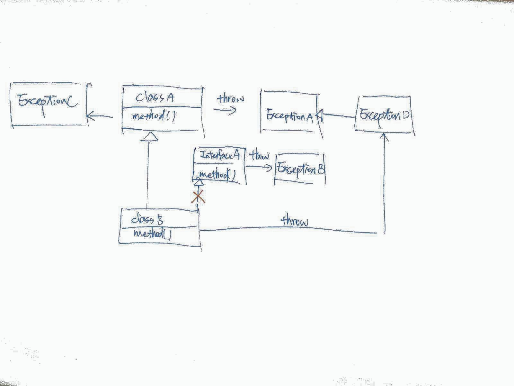

Yu-Ting Chen's Note
==

# Content
- [Assertion](#assertion)
- [try-with-resources](#try-with-resources)
- [Restriction of Try](#restriction-of-try)

# Assertion
See the [**Oracle Documentation**][Programming With Assertions].

- The assertion statement has two forms:
	1. `assert Expression1 ;`
	2. `assert Expression1 : Expression2 ;`
- Expression1 is false: throws an `AssertionError`
- Expression2 is detail message.
- Now, see the *DemoAssertionError* example below. Run the example with `-ea` option.
	

	```java
	public class DemoAssertionError {

		public static void main(String[] args) {
			//run with -ea option and get
			//Exception in thread "main" java.lang.AssertionError: HI
			//at DemoAssertionError.main(DemoAssertionError.java:5)
			assert false : "HI";
		}

	}
	```
- There are also situations where you should **not** use them:
	+ for argument checking in public methods.
	+ to do any work that your application requires for correct operation.
		```java
		// Broken! - action is contained in assertion
		assert names.remove(null);

		// Fixed - action precedes assertion
		boolean nullsRemoved = names.remove(null);
		assert nullsRemoved;  // Runs whether or not asserts are enabled
		```
- There are many situations where it is good to use assertions, including:
	+ Internal Invariants
		* Below may fail if i is negative, as the % operator is not a true modulus operator, but computes the remainder, which may be negative.
		
			```java
			public class ModAssertionExample {

				public static void main(String[] args) {
					System.out.println((-1) % 3);
					int i = -1;
					if (i % 3 == 0) {

					} else if (i % 3 == 1) {

					} else {
						assert i % 3 == 2 : i;
					}
				}

			}
			```
		* Another good candidate for an assertion is a switch statement with no default case. 
			```java
			default:
			    assert false : suit;
			```
	+ Control-Flow Invariants
		* place an assertion at any location you assume will not be reached.
			```java
			void foo() {
			    for (...) {
			      if (...)
			        return;
			    }
			    assert false; // Execution should never reach this point!
			}
			```
	+ Preconditions, Postconditions, and Class Invariants
		* Preconditions — what must be true when a method is invoked.
			- Lock-Status Preconditions — preconditions concerning whether or not a given lock is held.
		* Postconditions — what must be true after a method completes successfully.
		* Class invariants — what must be true about each instance of a class.

# try-with-resources
See the [**Java Tutorail**][try-with-resources].

The try-with-resources statement is a try statement that declares one or more resources. 
- A resource is an object that must be closed after the program is finished with it. 
- The try-with-resources statement ensures that each resource is closed at the end of the statement. 
- Any object that implements `java.lang.AutoCloseable`
	+ subinterface `java.io.Closeable`
- "ReadFile.java":

	```java
	import java.io.BufferedReader;
	import java.io.FileNotFoundException;
	import java.io.FileReader;
	import java.io.IOException;

	public class ReadFile {

		public static void main(String[] args) throws FileNotFoundException,
				IOException {
			String path = "src/ReadFile.java";
			try (BufferedReader br = new BufferedReader(new FileReader(path))) {
				String input = null;
				while ((input = br.readLine()) != null)
					System.out.println(input);
			}
		}

	}

	```
- Prior to SE 7, use below:

	```java
	import java.io.BufferedReader;
	import java.io.FileNotFoundException;
	import java.io.FileReader;
	import java.io.IOException;

	public class ReadFileWithoutTryWithResource {

		public static void main(String[] args) throws FileNotFoundException,
				IOException {
			String path = "src/ReadFile.java";
			BufferedReader br = new BufferedReader(new FileReader(path));
			try {
				String input = null;
				while ((input = br.readLine()) != null)
					System.out.println(input);
			} finally {
				br.close();
			}
		}

	}

	```

# Restriction of Try
Observe below figure and compare it with code 



```java

class ExceptionA extends Exception{}
class ExceptionB extends Exception{}
class ExceptionC extends Exception{}
class ExceptionD extends ExceptionA{}

abstract class ClassA {
	abstract void method() throws ExceptionA, ExceptionC;
}

interface InterfaceA{
	void method() throws ExceptionB;
}

interface InterfaceB{
	void method() throws ExceptionA;
}

class ClassB extends ClassA
{
	//(OK) void method() throws ExceptionA, ExceptionC {}
	//(OK) void method() throws ExceptionA{}
	//(OK) void method()
	//(OK) void method() throws ExceptionD{}
	@Override
	void method() throws ExceptionD{}
	
}

//(FAIL)
//abstract class ClassC extends ClassA implements InterfaceA{}

```

- The restriction on exceptions does not apply to constructors. 
- Use the concept of polymorphism to seize the reasons for these restrictions.

# Reference
- [Programming With Assertions][Programming With Assertions]
- [Java Tutorail][try-with-resources]


[Programming With Assertions]: http://docs.oracle.com/javase/7/docs/technotes/guides/language/assert.html
[try-with-resources]: http://docs.oracle.com/javase/tutorial/essential/exceptions/tryResourceClose.html